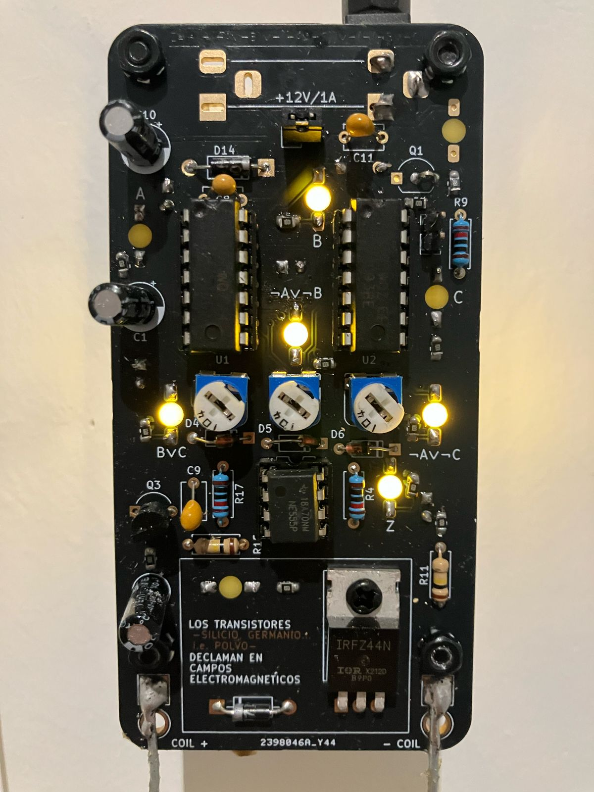
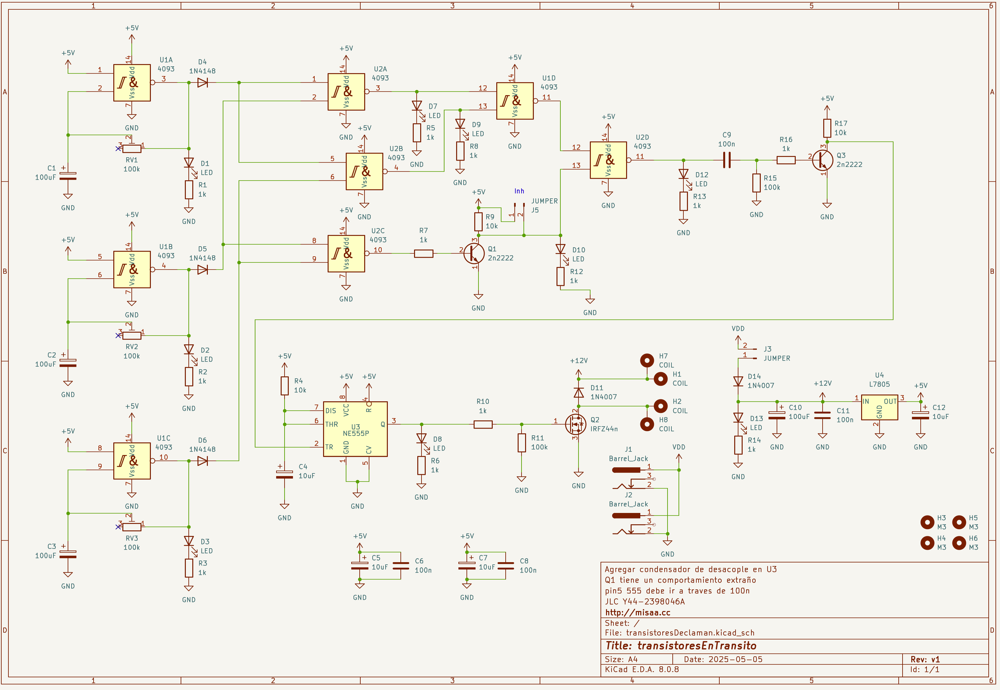
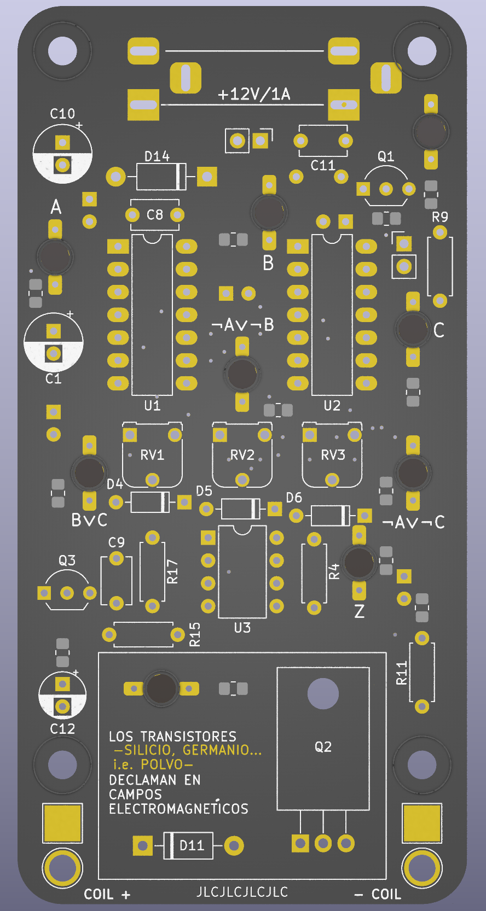
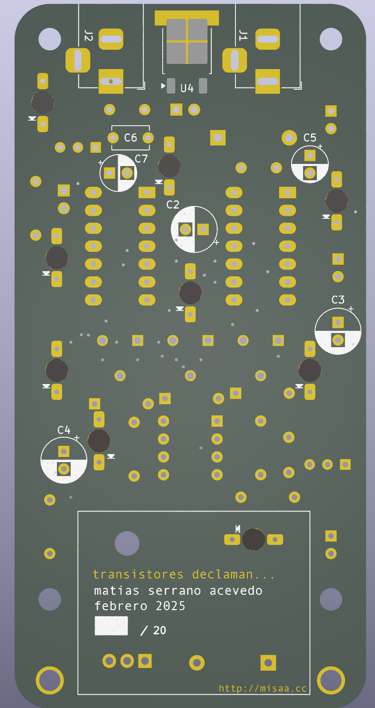

# transistoresDeclaman
circuito para instalación sonora basada en compuertas NAND y sistemas imán-bobina caseros

# ruidoRupestre

**Tarjeta de presentación**

Circuito activador de sistema iman-bobina en base a circuito de compuertas NAND y 555 en modo monostable

También utilizada en obra ["Transistores en tránsito"](https://misaa.cc/projects/transistoresentransito.html) (MAC 2025), controlando bobinas suspendidas en la pared

## Esquemático

- Control de frecuencia de 3 osciladores por medio de trimpots

- Visualización de estados por medio de LEDS

- Poesía basada en Jussi Parikka

### Issues versión JLC Y44-2398046A 

- Pin 5 de 555 NO debe ir a tierra directamente

- Q1 tiene comportamiento extraño. No ubicar y puentear pines 2 y 3

- D13 es demasiado brillante, se recomienda no instalar. Se podría instalar una resistencia más grande en R14

- Las bobinas deben ser de alrededor de 8 a 12 ohm

## BOM

| Reference                                     | Value       | Footprint                 | Qty |
|------------------------------------------     |-------------|---------------------------|-----|
| R1,R2,R3,R5,R6,R7,R8,R10,R12,R13,~R14~,R16    | 1k          | Resistencia SMD 0805      |  12 |
| U4                                            | L7805       | Regulador TO-252          |   1 |
| U3                                       | Socket      | DIP-8                     |   1 |
| U1,U2                                    | Socket      | DIP-14                    |   2 |
| R11,R15                                  | 100k        | Resistencia THT           |   2 |
| R4,~R9~,R17                                | 10k         | Resistencia THT           |   3 |
| D4,D5,D6                                 | 1N4148      | Diodo                     |   3 |
| D11,D14                                  | 1N4007      | Diodo                     |   2 |
| Q1*,Q3                                    | 2n2222      | Transistor to-92          |   2 |
| C6,C8,C9,C11                             | 100n        | Condensador               |   4 |
| C1,C2,C3,C10                             | 100uF       | Condensador Electrolítico |   4 |
| C4,C5,C7,C12                             | 10uF        | Condensador Electrolítico |   4 |
| D1,D2,D3,D7,D8,D9,D10,D12,~D13~          | LED         | Led 3mm                   |   9 |
| J3,J5                                    | JUMPER      | Pin header 2              |   2 |
| RV1,RV2,RV3                              | 100k        | Trim RM-065               |   3 |
| Q2                                       | IRFZ44n     | Transistor to-220         |   1 |
| J1,J2                                    | Barrel_Jack | Jack DC 2.1mm             |   2 |
| J3,~J5~                                    | JUMPER      | Jumper 2p                 |   2 |
| U3                                       | NE555P      | DIP-8                     |   1 |
| U1,U2                                    | CD4093      | DIP-14                    |   2 |

\* Reemplazar por puente entre pines 2 y 3

## Expo MAC

Foto: Clo Rojo